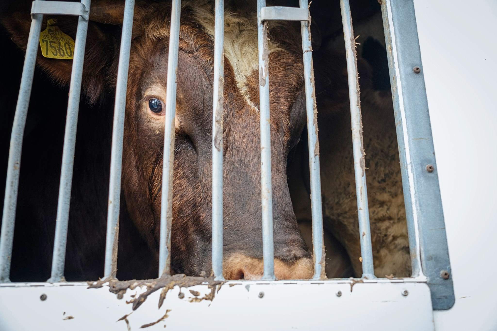

Tre dagar utanför Hkscan med Linköping Animal Save. Ett av Sveriges största slakterier. Här dödas över 700 individer varje dag. Kor och får kommer inrullandes i transport efter transport. Det är varmt ute. Det måste vara över 25 grader. Jag tittar in en transport där fåren står tätt. Jag svettas och blir uttorkad av att vara ute i solen så jag häller i mig vatten. Jag undrar hur det känns att vara instängd i en transport i den här hettan utan att tillgång till vatten.

Vi avviker från vigilen för att samla på oss mer material. Väktaren öppnar grindarna så att chauffören inte behöver stanna. Scan och de övriga industrierna är fullt medvetna om att verkligheten minskar försäljningen. Vi ställer oss framför en av transporterna i brist på alternativ. Chauffören hänger på tutan. Djuren blir märkbart stressade. Det är kö till avlastningen men även han är mån om att djurförtrycket ska ske i det dolda. Polis tillkallas till platsen och hot om att forsla iväg de som stör djurplågeriet utfärdas. Polisen är vän av ordning och inte av rättvisa. Chauffören skriker att nästa gång kör han över oss. Det verkar som att våld mot djur bryter ner empatin för sina medmänniskor.

Samtliga delaktiga i djurförtrycket säger att dom bara gör sina jobb. Väktaren gör som Scan säger. Polisen upprätthåller blint lagen. Ingen har tänkt en egen tanke utan gör bara som man blir tillsagd. Alla jobbar frivilligt för att Hkscan AB och dess ägare ska göra miljoner på djurens bekostnad. För att upprätthålla kapitalets mål, profit. Ingen har förmågan att resonera kring vad som är rätt eller fel. Djuren fortsätter att lida.

Tillbaka på vigilen pekar gamla gubbar finger. Yngre grabbar hänger ut genom rutan och gapar högt. En försvarsmekanism för de som inte klarar av självreflektion. En äldre man kommer förbi och berättar att han inte ätit kött på 60 år. Han ser knappt ut att vara 60 år gammal. 75 berättar han. Han berättar att hans bästa vän inte heller äter kött. Ett trevligt avbrott från det övriga.

Gemenskapen är stor. Vi är runt 30 personer som valt att lägga vår lediga tid på att belysa våldet mot djuren. Det är skönt att inte vara ensam. Att inte vara den enda som bryr sig. Att få känna sig normal för ett par dagar. Träffa gamla och nya vänner. Andra som förstår vad som är viktigt. Vänner av rättvisa. Tack.

Foto: Martina Vedin

Foto: @animalsarebeingstoo

Foto: Martin Smedjeback
