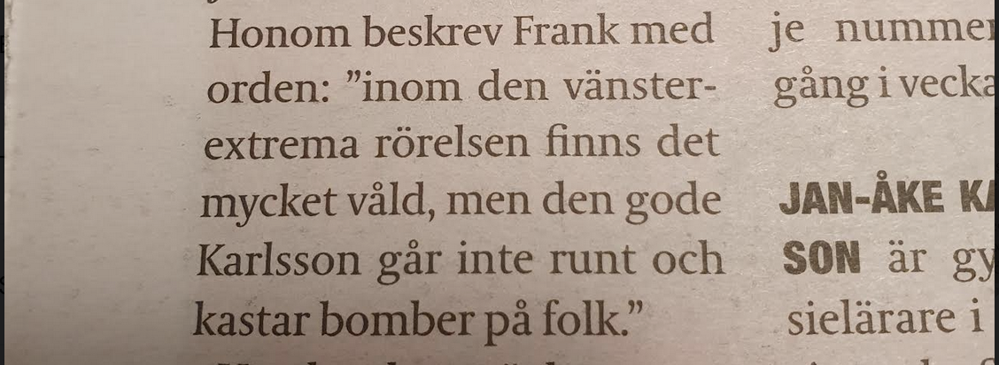
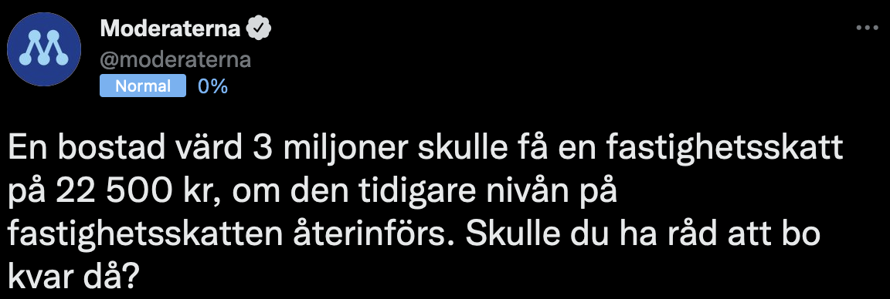

Växjö är ett mikrokosmos av hur en moderatledd ekonomisk politik skulle fungera på en nationell nivå. En tydlig uppdelning mellan **dom som har**, och **dom som inte har**. I Växjö kommun räcker det inte att den som äger sin bostad får bidrag som bland annat ROT- och räntebidrag. Mycket vill ha mer. Här har man även bestämt att hyrestagare ska subventionera kommunalskatten med 100 miljoner varje år. Vi ligger i topp när det gäller uttag från allmännyttan i landet. Man tar från **dom som inte har**, för att ge till **dom som har**. En slags omvänd Robin Hood.

När jag klottrade mitt missnöje för det nya kommunhuset på ett tillfälligt plank utanför byggplatsen beklagade kommunstyrelsens ordförande Tenje sig att det var absolut inte så man gjorde, det fanns riktiga sätt att föra debatt. Så när jag tänkt på den här orättvisan som hyrestagare utsätts för bestämde jag mig för att göra något mindre radikalt. Jag använde Tenjes egna hemsida “Fråga Anna” för att helt enkelt skicka en fråga om vad som motiverade detta beslut.

Men det kom aldrig något svar. Inte för att det är något nytt när det gäller våra lokala moderatpolitiker; tidigare läste jag en intervju i Lokaltidningen med Tenjes företrädare, Frank, där han sa att “inom den vänsterextrema rörelsen finns det mycket våld” men fick ingen följdfråga av reportern. 2 månader senare stormade högerextremister i USA Kapitolium. Jag mailade Frank för att fråga vilket våld han refererade till, men svar uteblev även där. Jämför med riks: Moderaterna presenterar siffror om hur många som inte är självförsörjande men undviker att redogöra dom, väljarna bryr sig knappast hur det är uträknat.

Nåväl. Till slut fick jag svar på min fråga genom debatten mellan Tenje och Garmer (V) i P4 Kronoberg. Det ska drivas som ett företag. Tenje gör en jämförelse med att köpa en tröja på HM där kunden inte får ta del av vinsten från försäljningen - hyresgästen är kunden. Detta verkar vara helt enligt partilinjen då Rosengren gjort samma jämförelse, fast då med en burk Coca-Cola.

Men tänk ändå att en bostad, _en grundpelare i behovstrappan_, ska reduceras ner till att jämföras med en massproducerad stapelvara. (Tappar man perspektivet när man lyfter över en miljon i årslön?) En bostad kan inte primärt få finnas för att någon ska bo där. Faktiskt ingenting i en marknadsekonomi får finnas för sitt egentligen syfte. En varas syfte, vilken vara som helst, är att säljas och generera vinst.

Samtidigt som detta sker år in och år ut i lilla Växjö gapar rikspartiet högt om att en återinförd fastighetsskatt från Socialdemokraterna (vilket dom går till val på att inte göra) kommer drabba villaägare med tiotusentals kronor per år. Stackars **dom som har**. Men hur ska jag kunna sympatisera med detta när **vi som inte har** idag i moderatledda Växjö betalar femsiffriga belopp i straffskatt varje år? Hur kan jag känna annat än att det vore skönt med lite rättvisa, att **dom som har** också får känna hur det känns?

Vi ser i alla fall på denna lilla slice av “moderat” ekonomisk politik, bostadspolitiken, hur man vurmar för **dom som har** medan **dom som inte har** ska sugas ut. Måste det vara så jävla orättvist?

Max Malm  
Kund hos Växjöbostäder
