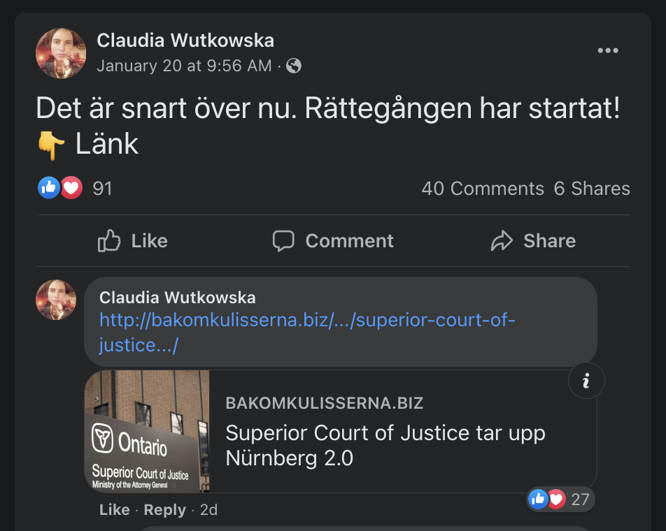
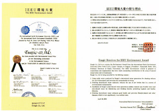
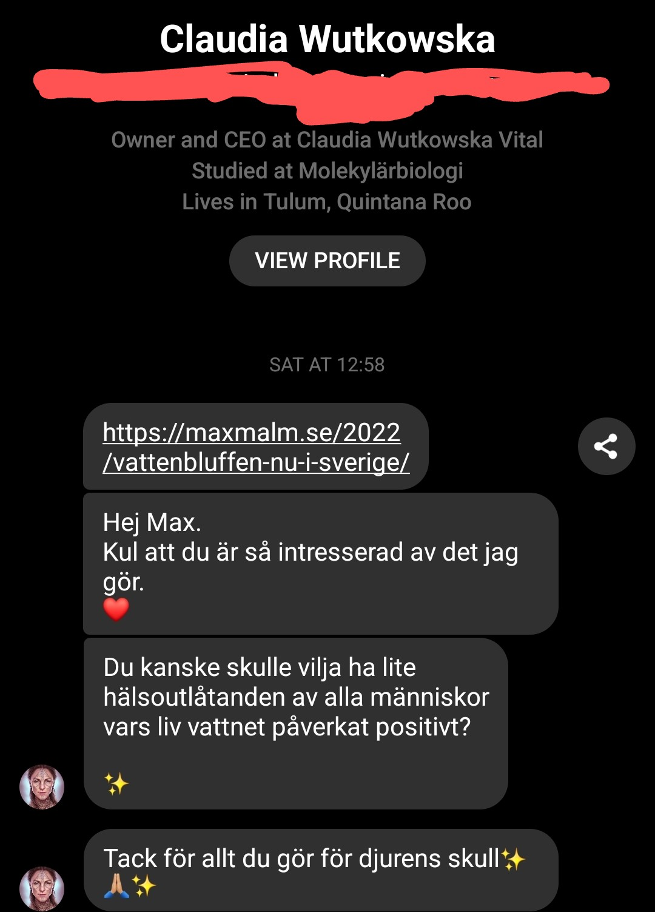

**Uppdatering 2022-12-11:** _[Claudia hör av sig](#uppdatering-2022-12-11)_

> Något att tillägga? Maila mig på vattenbluffen@malm.mozmail.com

Kangenvatten, från företaget Enagic, lovar genom sina distributörer högt; optimal hälsa - fysiskt, mentalt och finansiellt. Allt du behöver göra? Köpa, och själv börja kränga på andra, en maskin som kopplas på din vattenkran som gör vattnet alkaliskt och "omstrukturerat". En "distributör" jämför det med att "köpa Ferrari för fast för din hälsa" på sin Facebooksida.

> Men funkar det?

Nej, det finns inga konkreta belägg för att joniserat surt vatten skulle ge dig optimal hälsa. Högst troligen handlar det helt enkelt om att personen börjar dricka mer vatten vilket har bevisade hälsoeffekter (jämfört med uttorkning) som fysisk prestationsförmåga, högre energinivåer och hjärnfunktion, motverkar huvudvärk och förstoppning, etc. Kanske man vågar säga optimal hälsa? Det är också lättare att bryta dåliga vanor när man går in i nya vanor.

Men jag skriver inte det här för att gå in på det vetenskapliga, självklart är det en scam. Företaget Aqua Nobel som säljer "alkaliskt vatten" vågar inte skriva annat än att det **kanske** är bra för magen eftersom dom inte vill bli anmälda till Konsumentverket för vilseledande reklam.

## Distributörerna

Företag som Enagic jobbar på ett sätt så att dom inte behöver risken att bli anmälda till Konsumentverket. Om man besöker deras europeiska hemsida så lovar dom inte i närheten av vad jag skrev i första stycket. Dom pratar om "true health" men lovar inga mirakel. Man kan heller inte här köpa deras produkter utan dom använder sig av så kallade "distributörer". Du kanske har varit på homeparty och köpt Tupperware eller Aloe Vera av någon du gick i skolan med men inte träffat på flera (och inte sen dess), Enagic arbetar på samma sätt.

Tord Eriksson, som säljer dessa maskiner på Facebook under namnet Enagic Kangen Water Sweden, är en av dessa distributörer. Jag kontaktade honom för att få reda på vad maskinerna kostar då det inte fanns några priser på Kagens europeiska hemsida. Tord började med att skicka mig lite färdigskriven copy om värdet i att ha en Enagics vattenjonisator och lite Youtube-filmer som pratar om forskningen bakom detta. Sen rekommenderade han mig toppmodellen Kangen K8 till en kostnad av hela 47 725 kronor (4575 euro). Jag fattade redan innan mitt "gräv" att det här skulle vara dyrt, men att det skulle kosta närmare 50 000 kronor kunde jag inte tänka mig. Enligt SCB räcker det till att hyra en medeltvåa i nästan 8 månader. Eller så kan du köpa en Ford Focus Kombi årsmodell 2015. Eller 7 stycken Xbox Series X. Eller 1909 McVegan. Ni fattar poängen, det är rör sig om mycket pengar.

Jag tog upp detta med Tord, sa att det rörde sig om "ganska mycket pengar". Tord berättade att det finns möjlighet att köpa maskinerna på kreditkort och att en del sätter inköper på sina lån "på grund av en låg återbetalningsprocent". Jag frågade dock inte vad han menade med det. Men det fanns också en annan väg att gå; Enagic ger också dom som köper en maskin möjligheten att också i sin tur sälja maskiner till andra. Skulle jag göra detta så skulle jag troligen tjäna tillbaka mina pengar efter ha sålt 8-10 maskiner. Allt jag behöver göra är alltså att sälja dessa vattenmaskiner för en summa av cirka 450 000 kronor.

Jag var intresserad, självklart ville jag tjäna igen mina 47 725 kronor jag spenderat, men hur mycket tjänar jag per såld maskin? Tord berättar att varje försäljning ger 8 "poäng". En poäng är värd 200 euro och beroende på hur många maskiner du (eller dina underdistributörer) har sålt får du fler poäng av försäljningen, men max 6 poäng. Så här ser belöningslistan ut:

- 1-2 maskiner: 1 poäng
- 3-10 maskiner: 2 poäng
- 11-20 maskiner: 3 poäng
- 21-50 maskiner: 4 poäng
- 51-100 maskiner: 5 poäng
- 101+ maskiner: 6 poäng

Så för min första maskin jag säljer får jag 1 poäng, det vill säga 200 euro. Resten av poängen går vidare till Tord som plockar ut poäng enligt samma lista, sen går poängen vidare till personen som värvade Tord, och så vidare tills poängen är slut. Om jag då säljer 10 maskiner, utan att värva någon under mig, så skulle jag få 3 600 euro för poängen. Tord, om han skulle ligga på 4 poäng, skulle få 8 000 euro. 12 000 euro om han skulle ligga på högsta nivån. Mina försäljningar räknas också in i Tords försäljningar när det kommer till att klättra i belöningstrappan.

Så med andra, Kangen säljer en produkt för 4575 euro (inklusive moms) varav 200 euro \* 8 poäng = 1600 euro redan är avsatta för att försvinna upp i pyramiden. 3660 (priset exklusive moms) - 1600 = 2060. 2060 \* 1.25 = 2575 euro inklusive moms (26 850 kronor) är alltså priset för en maskin utan pyramidspelsavgiften. Kanske inte en helt rättvis jämförelse då Kangen kanske hade behövt lägga mer pengar på marknadsföringskostnader om inte detta gjordes av distributörerna, men det är ändå en summa av komma ihåg till senare.

Min första kontakt med Tord var den 21a januari. Mitt sista var den 23e januari, jag sa att jag skulle fundera på om jag verkligen ville ta ett lån för detta. Efter det hörde Tord av sig 5 gånger:

- 2a februari
- 10e februari
- 12e februari
- 6e mars
- 10e april

## Nätverken

Tord förklarade att tack vare belöningsstrukturen så främjas man att ge tips och råd emellan sig vilket skapar en trevlig samarbetsandra. Detta ter sig i form av så kallade "nätverk" där någon person utgör toppen av nätverket där man samlar alla sina underdistributörer i ett community. Ett av dessa nätverk vid namnet Vital Living Water, som drivs av Claudia Wutkowska, är det som kommer med påståendet om "optimal hälsa" som jag nämnde i början av artikeln. Jag stötte på Claudia via en gemensam vän på Facebook som promotade Claudias event "Följ din passion till frihet genom levande vatten". På detta eventet kommer besökarna att få höra allt om Kangens fördelar och om hur du kan leva livet "i flow" på dina egna villkor. Självklart är det yttersta målet att få dig att köpa en av dessa maskiner och själv börja sälja dom till andra för att slussa poängen uppåt i ledet till i det här fallet Claudia. Claudia kommer alltid att få minst 2 poäng av allt du säljer, även om du når upp till högsta belöningsstegen.

I nätverket kommer du sedan att få tips på hur du ska rekrytera in andra i pyramiden, eftersom att även din underdistributörer kommer att gynna nätverkstoppen direkt ekonomiskt tills dina underdistributörer och du tillsammans kommit upp till en nivå som äter upp alla poängen innan dom slussas vidare. I nätverk som dessa kommer du utsättas för "kärleksbombning" och bli matad med tveksam forskning presenterad som absolut fakta, precis samma tekniker som kulter använder på sina medlemmar.

När jag i kommenterna i ovan nämnda Facebookinteraktion påstod att Claudia, denna självutnämnda mikrobiolog, höll på med ett pyramidspel för att sälja produkter bad hon mig att "kolla upp det på riktigt" och referade mig helt ogenerat till sitt egna nätverks hemsida. En hemsida där hon kan skriva precis vad hon vill, bland annat står det att det inte är en MLM vilket vi ganska tydligt kan dra slutsatsen att faktiskt är med all info som Tord presenterade för mig. Efter att hon skickat länken började hon diskreditera sökresultaten man får upp om man googlar t ex "kangen water scam", prata om hur kompensationsplanen är patenterad och godkänd av några förkortningar jag inte kände till och som inte gick att googla upp, att jag skulle värdera mig själv högre än att slösa tid på att "basha" andra. Till sist rundade hon av med att säga att jag verkar vara intelligent och ha ett stort hjärta och att hon är övertygad att jag skulle kunna "haja till". Först här vid smickret kom emojisarna. Manipulationen fulländad.

## Konspirationsteorierna

Något mer Claudia nämnde i sin långa kommentar var att hon "lyssnar på läkare, vetenskapskvinnor och män". Samtidigt visar en snabb titt på Claudias Facebookprofil att hon är en inbiten anti-vaxxer, hon sprider konspirationsteorin om Nürnberg 2.0. För dig som inte är så insatt i anti-vaxxers lore så handlar denna konspirationsteori om att världsledarna ska dras inför rätta i domstolen i Nürnberg, där 24 militära och politiska ledare från det besegrade Nazityskland ställdes inför rätta. Logiken är att genom vaccinet mot Covid-19 används människor som försökskaniner vilket klassas som brott mot mänskligheten. Den tyske advokaten Reiner Füllmich som är profilen bakom konspirationsteorin har fått in miljoner kronor i donationer av privatpersoner som han lyckats lura. Även Tord delar vaccinkritiska kommentarer på sin Facebookprofil, om än inte lika grova.

Både om man tror att Claudia och Tord är "believers" (som verkligen tror på vad dom säljer) eller "grifters" (någon som utnyttjar andras okunskap för att tjäna pengar) så känns det ganska naturligt att personer som säljer dessa vattenmaskiner även simmar i konspirationsteorivatten. Att få någon som tror att "dom använder vaccinet för förslava oss" till att också tro att alkaliskt vatten gör dig närmare odödlig kräver troligen inte någon större ansträngning.

## Alternativen

Låt oss ponera att detta maskiner fyller ett riktigt syfte. Varför Enagic? Enagic påstår själva, eller rättare sagt deras distributörer via sina nätverk, att endast deras maskiner är tillräckligt bra och kopiorna inte håller måttet. Man hänvisar till "Japanese Association of Preventive (ibland Preventative) Medicine for Adult Diseases" (JAPA) som tydligen erkänt Enagic som enda tillverkaren som håller måttet, och det låter ju väldigt bra, men om man börjar googla är det väldigt svårt att hitta något om JAPA och Kangen som inte är skrivit av någon som säljer Kangen. JAPAs officiella hemsida är på japanska så jag kunde inte hitta någon om Kangen där, dock kunde jag genom Google translate luska ut att det inte är någon statlig organisation. Följer man alla spåren så hänvisas man till slut till en blogpost från 2009 som kommer med påståendet men helt utan någon vidare källhänvisning.

I samma bloggpost berättar man också att Enagic mottagit "the International Earth Environment University (IEEU) Award". IEEU var väldigt svårgooglat men till slut hittade jag ytterliggare en japansk hemsida som påstår att IEEU grundades av nobelpristagaren Linus Carl Pauling, något som dessvärre inte reflekteras på hans Wikipedia-sida. I samma stycke nämns också "Postdoctoral Institute of Spirituality Science" men en sökning på det returnerar inga andra sökresultat hos google. Som bevis på priset finns den här bilden:

Men på denna mikroskopiska bild går det knappast att utläsa något. Jag kunde heller inte hitta något med googles omvända bildsök. Man kan också tycka att dessa erkända organisationer skulle finnas med på Wikipedia, men så är inte fallet.

Stefano Zuffanelli, som driver webbshopen Livsvatten och säljer i princip samma typ av maskiner, skriver i ett blogginlägg att det inte alls finns några skillnader mellan "äkta" Kangenvatten och det vatten hans maskiner producerar. Livsvattens toppmodell kostar idag 22 900 kronor, jämför detta med 26 850 kronor vilket var priset vi fick fram på Enagics toppmodell om vi räknade bort pyramidspelstillägget. Stefano lyfter även detta i sitt blogginlägg och hänvisar till belöningspengen som läggs på för varje försäljning. Intressant nog är även Stefano öppet vaccinkritisk på sin Facebookprofil.

Troligen tar även Stefano ett kraftigt överpris för sina maskiner då AliExpress har en hel uppsjö av olika modeller i prisintervallen 3 000 - 10 000 kronor med bra betyg.

## Slutsats

Den som försöker sälja på dig en vattenmaskin, speciell via pyramidspel som Enagic, har som vi sett ovan otroligt starka ekonomiska incitament att göra det och i ryggen har dom andra med minsta lika stora ekonominska incitament som peppar, pressar och manipulerar dom att sälja till dig. Det är väldigt svårt att faktagranska påståenden som kommer från Enagics distributörer då man ofta hamnar på andra distributörers webbplatser eftersom dom bara kopierat av varandra, kanske av sin egna mentor. Vill du ha en lyxig apparat som får dig att dricka mer vatten så verkar Aarke Carbonator 3 vara en lämplig maskin, till cirka 5% av priset för en Kangenmaskin. (ej sponsrad)

### Uppdatering 2022-12-11

Först när jag skrev den här artikeln hoppades jag bara att en enda person som höll på att bli inlurad i detta pyramidspelet som är Kangen skulle hitta hit och komma på andra tankar. Idag är det 300 personer som klickat sig hit, främst via Google och allra främst via sökordet "kangenvatten bluff". Och eftersom Claudia (som omnämns i artikeln ovan) hörde av sig igår och ville "tacka" mig för att jag intresserar mig vad "hon gör" kan jag bara anta att min text har gjort lite nytta.

Det här är vad hon skrev. Hon skickade även 2 ljudklipp som jag valde att inte lyssna på. Jag har länge anat att Claudia lider av [NPD](https://sv.wikipedia.org/wiki/Narcissistisk_personlighetsst%C3%B6rning) eller något liknande och detta meddelandet känns som en bekräftelse på det (jag är såklart ingen läkare och kan diagnostisera någon). En normal person som inte ser alla omkring sig som hinder som måste manipuleras hade inte skrivit såhär till någon som pekat ut den som konspirationsteoretiker. Detta är beyond "kill them with kindness".

Jag får i meddelandet också ett erbjudande om att ta del av "hälsoutlåtanden" från personer som påverkats positivt "av vattnet". Notera ordvalet, **hälsoutlåtande**. Vad betyder det ens? Det verkar inte vara en korrekt term utan något som låter snarlikt **läkarutlåtande om hälsotillstånd** vilket är något en legitimerad läkare skriver om en patient. Men det är inte något sånt utlåtande Claudia erbjuder mig här, det är i själva verket **anekdoter** från andra som blivit inlurade i denna vattenbluff. En anekdot är inte värt något som bevis för att detta Kangenvatten skulle ge dig några som helst superkrafter. Det finns en anledning att det inte finns några studier som styrker Claudia med fleras påståenden om vatten - det är en bluff. **En stor fet bluff.**

Det enda jag svarade på ovanstående meddelandet var "nej tack, kontakta inte mig igen" och sen blockerade jag Claudia. Jag ville inte fastna i någon oändlig diskussion med någon som bara har för avsikt att manipulera mig. Detta kan en person som Claudia inte godta utan idag skrev hon ett öppet brev till mig på sin Facebooksida där hon skriver att hon **"förlåter mig"** (som att jag bara var en vilsen själ som inte visste bättre 😢 - detta kallas för negging och används ofta för att göra offret mer mottagligt för den kommande love-bombingen, t ex "tack för allt du gör djuren" vilket nämndes många gånger i inlägget) och bortförklarar allt jag tar upp här i artikeln.

Detta är också typiskt NPD, att försöka styra folks uppfattning om eventuella dissidenter innan dom ens hinner ta del av deras budskap. Man grundar potentiella kultmedlemmar med meningar som _"det är inte så farligt att vi tar 20 000 kr överpris, tänk hur många procent Apple tar i vinst på en iPhone!"_ för att dom inte ska ens ska tänka 2 gånger på hur mycket Claudia ämnar att tjäna på dom. Och tänker man inte på de otroligt stora vinsterna Claudia gör är det svårare att förstå hennes incitament att verkligen sälja dessa maskinerna och dessutom rekrytera andra som i sin tur säljer och rekryterar vidare.

Och ett förtydligande angående vinsten; det jag tar upp i min text här gällande "överpris" gör ingen som helst analys av _vad Enagic själva gör för någon vinst på produkten_ utan bara vad **återförsäljarna** tjänar, men Claudia har inga problem att förbise den delen för att kunna påstå att maskinerna "bara" säljs med ett 100%-igt påslag. En narcissist i damage control-läge har inte tid att presentera sakligt, det handlar bara om att kväva motståndet så snabbt som det går för att återställa den falska fasaden.

Har du läst såhär långt tackar jag dig för din tid. Jag vill också rekommendera dig att läsa på om **narcissistisk personlighetsstörning**, speciellt om vilka olika tricks dom använder för att manipulera personer i sin omgivning. Har man en gång läst på om hur dom opererar är det såklart mycket lättare att upptäcka innan man faller dit.
