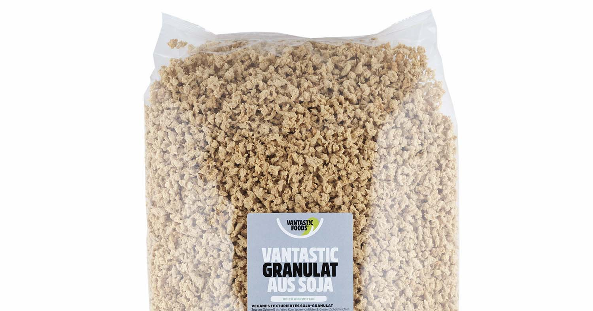
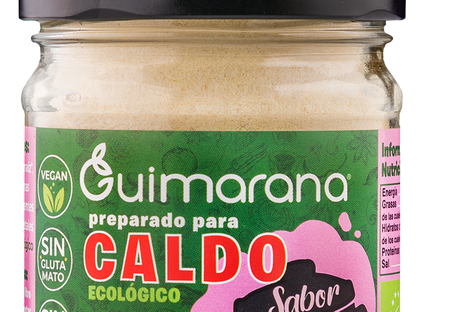

TVP, texturerat vegetabiliskt protein, är en billig köttersättningsprodukt med en otroligt lång hållbarhetstid. Jag äter oftast Anammas vegofärs, den passar verkligen till allt, men den har - precis som det mesta - blivit så dyr. Nu kostar 1 kg över 90 kronor på mitt lokala Coop. Tittar man på ingredienserna så är dom ganska simpla:

> Vatten, sojaprotein (26%), rapsolja, lök, salt, kryddor, naturliga aromer, karamelliserat socker.

Ovan nämnda **sojaprotein** är den torkade sojafärsen (TVP) man kan köpa i affären och på nätet. Jag hittade en påse med 1,5 kg torkad sojafärs att köpa online för 179 kronor. Om man tittar på ovan ingredienser borde vi kunna omvandla det till cirka 6 kg stekfärdig färs.

Jag tänkte börja enkelt, färs, buljong, socker, och vatten. Socker behövs för maillardreaktionen som ger färg och en mångfald av smak- och doftnyanser. Samtidigt som jag beställde den torkade färsen beställde jag också en vegansk fläskbuljong från Guimarana (79 kronor) som verkade fancy. Hade nog hellre valt någon av deras andra buljonger, men det var denna som fanns i lager just nu.

### Experiment 1

- 2 dl TVP
- 1 matsked Guimarana buljong (fläsk)
- 1 tesked rårörssocker
- 2 dl kokhett vatten
- Låt stå 15 minuter

Första experimentet blev väldigt bra! Känner redan att göra egen färs kan bli en hit. Lite för sött bara.

### Experiment 2

- 2 dl TVP
- 1 matsked Guimarana buljong (fläsk)
- 1 tesked brunt farinsocker
- 2 dl kokhett vatten
- Låt stå 15 minuter

Skulle testa med mindre socker men hittade inte rårörssockret så tog samma mängd fast med brunt farinsocker. Funkade också väldigt bra, men fortfarande lite för sött.

Passade på att väga allt den här gången.

- Vikt torr TVP: 53 gram
- Vikt alla ingredienserna kallt: 244 gram
- Vikt efter stekning i rapsolja: 179 gram

Detta blir en viktökning med cirka 237% från torrt till stekt.

### Experiment 3

- 2 dl TVP
- 1 matsked Guimarana buljong (fläsk)
- 1/2 tesked rårörssocker
- 2 dl kokhett vatten
- Låt stå 15 minuter

Hittade återigen rårörssockret och valde att testa med bara en halv tesked. Tyckte det främjade maillardreaktionen tillräckligt. Har försökt googla lite på hur mycket man behöver men kan inte hitta någon direkt tabell över vad som är en lagom mängd.

Stekte ihop detta med pasta, havregrädde och _Guimarana smaksättare Bacon & Ost_, det blev toppen.

Är nog ganska nöjd med experimenten hittills, kommer att testa andra buljonger härnäst. Guimarana verkar ha riktigt bra grejer, vill testa deras kyckling- och köttbuljoner.

Då till kostnaden:

1.5 kg \* 237% = 3.55 kg
179 kronor / 3.55 kg = cirka 50 kronor/kg

Detta är såklart utan att räkna in buljong och socker, men ändå billigare än 90 kronor/kg på Coop (eller 72 kronor/kg på Willys) som Anammas vegofärs kostar. Sparar också plats i frysen just, men har funderat på att förbereda en större mängd och frysa in. Återkommer när jag experimenterat med det!
