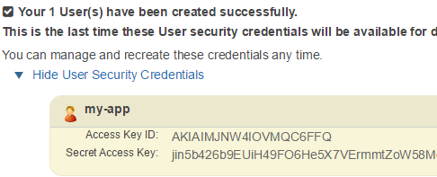

We're creating an IAM user to do the bucket upload for us, so we don't have to use the root account.

### Get S3 info

1. Go to [https://console.aws.amazon.com/s3/home](https://console.aws.amazon.com/s3/home) and log in

2. Press **Create Bucket** and name it something you'd like. I named mine `s3-my-test` and set the region to Frankfurt. This is your **AWS_S3_BUCKET** setting for later.

Find your **AWS_S3_REGION** in the list at [http://docs.aws.amazon.com/general/latest/gr/rande.html#s3_region](http://docs.aws.amazon.com/general/latest/gr/rande.html#s3_region) under the column _region_. For Frankfurt it's **eu-central-1**

3. Select your bucket, press **Add CORS Configuration** and put the following in:

```
<?xml version="1.0" encoding="UTF-8"?>
<CORSConfiguration xmlns="http://s3.amazonaws.com/doc/2006-03-01/">
    <CORSRule>
        <AllowedOrigin>*</AllowedOrigin>
        <AllowedMethod>PUT</AllowedMethod>
        <AllowedMethod>POST</AllowedMethod>
        <AllowedMethod>GET</AllowedMethod>
        <AllowedMethod>HEAD</AllowedMethod>
        <MaxAgeSeconds>3000</MaxAgeSeconds>
        <AllowedHeader>*</AllowedHeader>
    </CORSRule>
</CORSConfiguration>
```

4. Now click **Edit bucket policy** and paste the following, replacing `s3-my-test` with your own name

```
{
	"Version": "2012-10-17",
	"Statement": [
		{
			"Sid": "AddPerm",
			"Effect": "Allow",
			"Principal": "*",
			"Action": [
				"s3:GetObject"
			],
			"Resource": [
				"arn:aws:s3:::s3-my-test/*",
				"arn:aws:s3:::s3-my-test"
			]
		}
	]
}
```

This allows anyone to read from our bucket (get images)

5. Let's create a user. We don't want to use our admin credentials to upload files, that's just a disaster waiting to happen.

Click your name in the top right corner and go to [https://console.aws.amazon.com/iam/home](Security credentials). Then click Users or _Get started with IAM Users_

Press **Create new users** and put in a username. I'm going to use my-app as a username and leave the checkbox checked. After creating a link with the text **Show User Security Credentials** will be shown containing to rows, _Access Key ID_ and _Secret Access Key_. This is **AWS_API_KEY** and **AWS_API_SECRET**. You can't see these keys after you've left the page, so let's save them for now somewhere safe.



6. Attach this policy to your new user, note again swapping s3-my-test for your bucket name

```
{
    "Version": "2012-10-17",
    "Statement": [
        {
            "Effect": "Allow",
            "Action": "s3:ListAllMyBuckets",
            "Resource": "arn:aws:s3:::*"
        },
        {
            "Effect": "Allow",
            "Action": "s3:*",
            "Resource": [
                "arn:aws:s3:::s3-my-test",
                "arn:aws:s3:::s3-my-test/*"
            ]
        }
    ]
}
```
